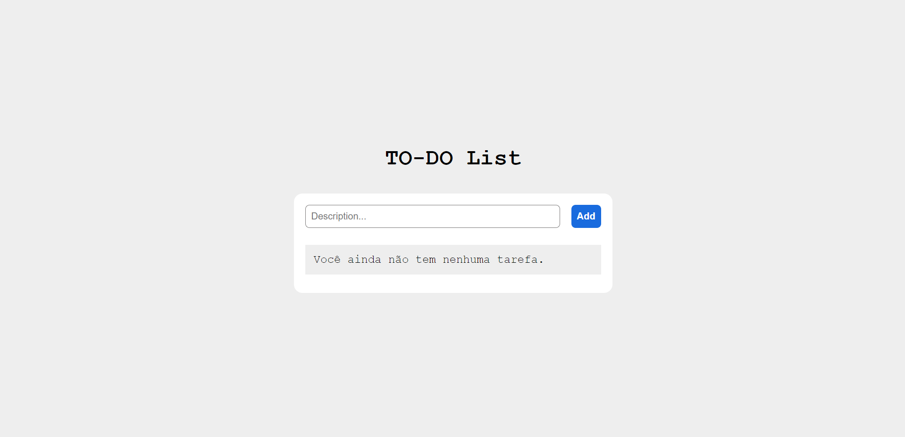

<h1 align="center"> TO-DO List </h1>

Todo-list project that keeps information in the browser using localstorage
 

  <a href="#-tecnologias">Technologies</a>&nbsp;&nbsp;&nbsp;|&nbsp;&nbsp;&nbsp;
  <a href="#-projeto">Project</a>

 

  

## 🚀 Technologies

This project was developed with the following technologies:

  
  
  

## 💻 Project
Access the live project here!

- [Online Project!](https://micaelsantiago.github.io/todo_list/)

## 🤝 Collaborators

<table>
  <tr>
    <td align="center">
      <a href="http://github.com/micaelsantiago">
         
        
          <b>micaelsantiago</b>
        
      </a>
    </td>
  </tr>
</table>

## 💻 Project status
* Concluded! ✔